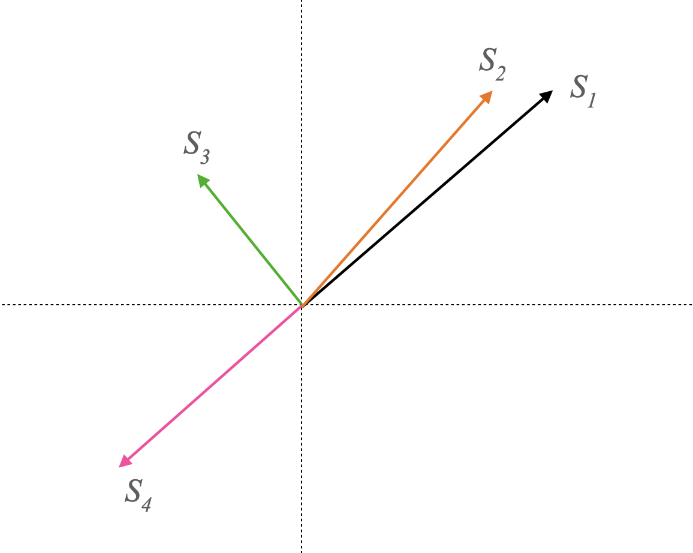

# LSA Coh-Metrix for Swedish using SBERT

This is an implementation of the Latent Semantic Analysis (LSA) cohesion measures from Coh-Metrix. It uses Stanza (Qi et al. 2020) for parsing texts and a Swedish SBERT model from the National Library of Sweden (Rekathati, 2021) for creating sentence embeddings.

## Running the script
The main class is `SBERTLSA` in `lsa_metrix.py`. Creating an instance of this, loads the SBERT model and the Stanza neural pipeline. Calling `compute_metrics` with a Swedish text string computes each LSA Coh-Metrix index, and returns a dictionary of the resulting metrics. 

### Example
Here is an example usage where the cohesion of an introduction to a Wikipedia article is measured.
```python
import pprint as pp

sbert_lsa = SBERTLSA()
text = "Bakterier (Bacteria) eller eubakterier (Eubacteria) är encelliga mikroorganismer utan cellkärna " \
       "och andra membranomslutna organeller; de har dock ribosomer. Bakterier räknas till prokaryoterna " \
       "som även inkluderar domänen arkéer. Bakterier är vanligtvis ett antal mikrometer långa och väger " \
       "ett antal hundra femtogram. Bakterier kan ha ett varierande utseende, bland annat formade som sfärer, " \
       "spiraler (helix) eller stavar. Studier av bakterier kallas för bakteriologi och är en gren inom " \
       "mikrobiologin. Bakterier kan hittas i alla ekosystem på jorden, i varma källor, bland radioaktivt " \
       "avfall, i havsvatten och djupt ned i jordskorpan. Vissa bakterier kan till och med överleva i extrem " \
       "kyla och i vakuum. I genomsnitt finns 40 miljoner bakterier i ett gram jord och en miljon bakterier i " \
       "en milliliter färskvatten."

metrix = sbert_lsa.compute_metrics(text)
pp.pprint(metrix)
```

Running this code results in the following output.
```
{'LSAGN': 0.48561007,
 'LSAGNd': 0.03398264,
 'LSASS1': 0.7689577378332615,
 'LSASS1d': 0.034975953486856844,
 'LSASSa': 0.7635695363084475,
 'LSASSad': 0.04251765633533103}
```

## Background
Here I provide a short background on Cohesion, Coh-Metrix, LSA and SBERT in order to give some context to the project.

### Cohesion
According to McNamara et al. (2014) cohesion is a feature of a text, and can therefore be measured and analyzed by directly assessing the text. This is in contrast to coherence, they argue, which is a psychological feature that arises between the connections of ideas. Cohesion, however, affects the coherence in the reader, so by measuring the cohesion of the text, we can indirectly measure the coherence in the reader. Higher cohesion in the text means higher coherence in the resulting ideas in the reader.

### Coh-Metrix
McNamara et al. (2014) has developed a set of computable indexes, for measuring cohesion, which they have named Coh-Metrix. At the time of writing, Coh-Metrix consists of 108 different indexes (see _Coh-Metrix version 3.0 indices_ for a full list of all the indexes). 

### LSA
The indexes in Coh-Metrix are divided into a set of categories (McNamara et al. 2014). One category is that which uses Latent Semantic Analysis (LSA) for measuring cohesion. LSA is a method for analysing text on the semantic level, as opposed to the syntactic structural level. In other words, LSA looks at the meaning of a text. To assess the meaning of a text, words (or sentences, or paragraphs) are converted into embeddings, that is, a vector in semantic space. In this space, embeddings that are pointing in the same direction mean similar things, while those pointing in different directions mean dissimilar things. See Figure 1 for an example.

<div style="text-align: center;">
    
</div>
Figure 1: Here are four sentence embeddings located in a semantic space of two dimensions. S1 is most similar to S2 since they point in the same general direction. S1 and S3 are orthogonal (in other words they are at a 90° angle), which means that their meanings are completely dissimilar. Finally, S1 and S4 point in opposite directions, meaning they have opposite meanings.

### SBERT
The LSA indexes in Coh-Metrix operate on sentence embeddings as well as paragraph embeddings. (I have not added support for paragraph embeddings yet!) Traditionally, embeddings for LSA have been created using a mathematical technique called Singular Value Decomposition (there are other methods as well). For this project, however, I have used Sentence-BERT (SBERT), which is an adaptation of the language model BERT, suitable for creating sentence embeddings (Reimers et al. 2019).

## Code structure

- `lsa_metrix.py`: contains the `SBERTLSA` class which parses and handles text using Stanza.


- `lsa.py`: implements the LSA measures and operates purely on embeddings. There are no references to Stanza or text elements (such as sentences, words, etc.) It is convenient to keep these operations separate from specific NLP libraries, allowing them to be used in other projects with other libraries.


- `sentence_embedding_processor.py`: contains a custom processor for the Stanza neural pipeline which computes an SBERT embedding for each parsed sentence, and assigns it to a custom `embedding` property in `Sentence`.

## Implemented indexes

Table 1: The LSA indexes that are implemented in this project. *Are custom indexes not included in the original Coh-Metrix. **Are not yet fully implemented.

| Index     | Description                                                                                         |
|-----------|-----------------------------------------------------------------------------------------------------|
| LSASS1    | The mean semantic overlap between each adjacent sentence pair in the text.                          |
| LSASS1d   | The standard deviation semantic overlap between each adjacent sentence pair in the text.            |
| LSASSa*   | The mean semantic overlap between every possible sentence pair in the text.                         |
| LSASSad*  | The standard deviation semantic overlap between every possible sentence pair in the text.           |
| LSASSp**  | The mean semantic overlap between every possible sentence pair within each paragraph.               |
| LSASSpd** | The standard deviation semantic overlap between every possible sentence pair within each paragraph. |
| LSAPP1**  | The mean semantic overlap between each adjacent paragraph pair in the text.                         |
| LSAPP1d** | The standard deviation semantic overlap between each adjacent paragraph pair in the text.           |
| LSAGN     | The mean given/new ratio for each sentence in relation to its preceding sentences.                  |
| LSAGNd    | The standard deviation given/new ratio for each sentence in relation to its preceding sentences.    |

## Remaining work
As Table 1 indicates, the indexes concerning paragraphs are not yet implemented. This is because Stanza does not seem to support paragraph segmentation. I plan to add a custom paragraph processor to the pipeline in the future.

## References
Coh-Metrix version 3.0 indices. http://cohmetrix.memphis.edu/cohmetrixhome/documentation_indices.html

McNamara, D. S., Graesser, A. C., McCarthy, P. M., & Cai, Z. (2014). _Automated Evaluation of Text and Discourse with Coh-Metrix_. Cambridge University Press. 

Qi, P., Zhang, Y., Zhang, Y., Bolton, J., & Manning, C. D. (2020). Stanza: A Python Natural Language Processing Toolkit for Many Human Languages Association for Computational Linguistics (ACL) System Demonstrations. https://doi.org/10.48550/arXiv.2003.07082

Reimers, N., & Gurevych, I. (2019). Sentence-BERT: Sentence Embeddings using Siamese BERT-Networks. arXiv. https://doi.org/https://doi.org/10.48550/arXiv.1908.10084 

Rekathati, F. (2021). The KBLab Blog: Introducing a Swedish Sentence Transformer. https://kb-labb.github.io/posts/2021-08-23-a-swedish-sentence-transformer/

